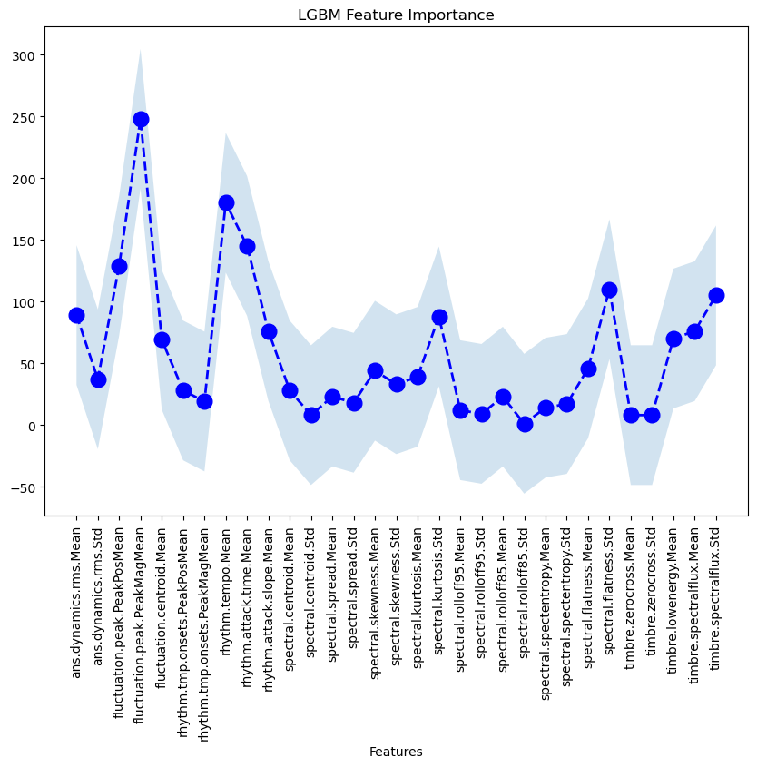

# PPG Sonification

# Introduction
The main objective of this project is to detect weather if a PPG signal has Atrial Fibrillation (AF) or Normal Sinus Rhythm(NSR). 

There are two different approaches in this project:
1. Classic AI.
Each window  from a PPG signal is segmented into 15 seconds as an audio wave file and features are extracted with *insert library*. 

2. DL for images. From the PPG signal, a spectrogram is generated for each 15 seconds window. Then, the spectrogram is converted into an image and the image is fed into a CNN. 

# Classic AI approach
The LazyPredict library is used to train a model with different algorithms. The variable "True" or "False" indicates if the data has been balanced with SMOTE or not. 

| Algorithm | Accuracy | Balanced Accuracy | ROC AUC | F1 Score |
|-----------|----------|-------------------|---------|----------|
| LGBMClassifier | 0.88 | 0.89 | 0.89 | 0.88 | 
| XGBClassifier | 0.88 | 0.89 | 0.89 | 0.88 |
| RandomForestClassifier | 0.87 | 0.87 | 0.87 | 0.87 |
| KNeighborsClassifier | 0.89 | 0.88 | 0.88 | 0.89 |
| LogisticRegression | 0.84 | 0.85 | 0.85 | 0.84 |

## Random Forest Classifier
With a Random Forest (RF) Classifier, the final accuracy achieved is a 90% without balancing with SMOTE. The confusion matrix is the following:

    

## KNearestNeighbors Classifier
The next experiment is done through a KNearestNeighbors (KNN) Classifier. The final accuracy achieved is a 87% without balancing with SMOTE. The confusion matrix is the following:

    

With a KNN we are able to extract some explainability through analysis of the feature importance. The following plot shows the feature importance of the KNN model:

    

## LG and LGBM Classifiers

| Algorithm | Accuracy |
|-----------|----------|
| LGBMClassifier | 89.15% |
| GBClassifier | 88.66% |

Confusion matrix from both classifiers are the following:

    

Then, we have been able to also extract feature importance for both models. The following plots shows the feature importance of the LGBM and GB model:

    
    
 

# DL with Images approach

For this approach, several images are obtained from each PPG signal when this is segmented. The images obtained and used to perform this evaluation have the following appearance:

    

## Network architecture - CNN

We are applying a simple yet effective CNN with just one convolutional layer to explore the explainability of it and how is the network working to classify those images into having AF or NSR.

Here we have the network's architecture:

    

Here we have the network detailed layer by layer:

|Layer (type) |     Output Shape     |  Param # |
|-------------|----------------------|----------|
|    Conv2d-1 |  [-1, 16, 222, 222]  |   448    |
|      ReLU-2 |  [-1, 16, 222, 222]  |    0     |
| MaxPool2d-3 | [-1, 16, 111, 111]   |    0     |
| Dropout2d-4 |[-1, 16, 111, 111]    |    0     |
|   Flatten-5 |         [-1, 16]     |    0     |
|    Linear-6 |         [-1, 1]      |    17    |
|      ReLU-7 |        [-1, 1]       |    0     |
|    Linear-8 |      [-1, 16]        |    32    |
|   Flatten-9 |     [-1, 16]         |    0     |
|   Linear-10 |     [-1, 1]          |    17    |
|     ReLU-11 |    [-1, 1]           |    0     |
|   Linear-12 |  [-1, 16]            |    32    |
|     CBAM-19 |[-1, 16, 111, 111]    |     0    |
|   Linear-20 |       [-1, 256]      |50,467,072|
|     ReLU-21 |      [-1, 256]       |     0    |
| ropout2d-22 |     [-1, 256]        |     0    |

*Forward/backward pass size (MB): 20.03*

*Params size (MB): 192.52*

*Estimated Total Size (MB): 213.12*

## Training evolution

Hence, after running the network for 50 epochs we obtain the following training and validation results in terms of accuracy:

    

The evolution of training, validation and test are in [here](./results_cnn/50-epochs-train.txt). 
At the end, the Accuracy obtained when testing for 50 epochs is a 95.20%. Which is shown to be more precise than the experiments performed over the features extracted of the PPG signals.

## Attention!

As we have only one convolutional layer, we can use the CBAM block (as shown in the network's architecture) to obtain the explainability of the CNN and see which has been the focus when classifying the network. 

    

